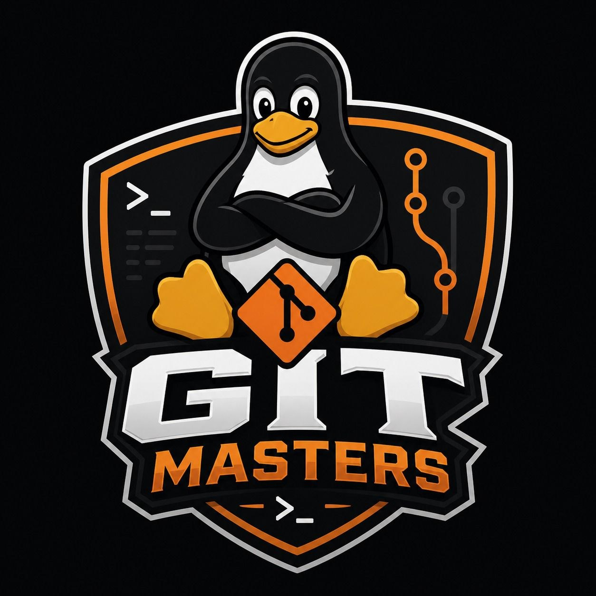
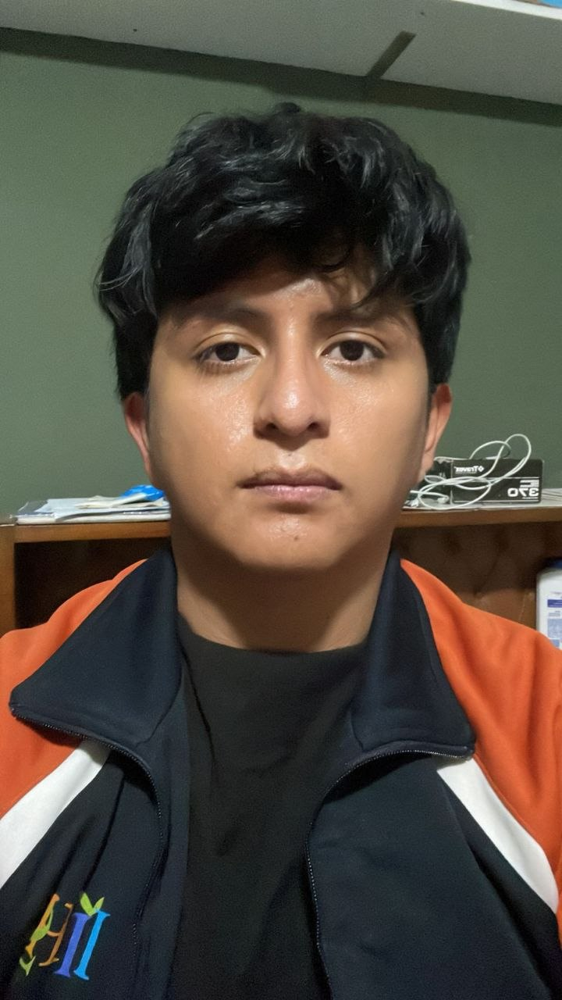

# ♟️ Club de Ajedrez Bravo's

<p align="center">
  
</p>

Aplicación web desarrollada con React para la gestión y promoción del **Club de Ajedrez Bravo's**.  
Incluye secciones como galería, eventos, contacto y nosotros.

---

## Integrantes

<table align="center">
  <tr>
    <td align="center">
      <br/>
      <b>Sebastian Bravo</b>
    </td>
    <td align="center">
      <br/>
      <b>Adalia Flores Escobar</b>
    </td>
  </tr>
</table>

---

## 🛠️ Tecnologías utilizadas

- ⚛️ React  
- ⚡ Vite  
- 🎨 CSS  

---

## 📂 Estructura del proyecto

```bash
src/
  ├── assets/ # imágenes
  ├── components/ # componentes React
  ├── pages/ # vistas (Contacto, Eventos, etc.)
  └── App.jsx
```

---


## ▶️ Cómo ejecutar el proyecto

1. Clonar el repositorio:
```bash
git clone <tu-repo>
```

Instalar dependencias:
```bash
npm install
```

Ejecutar:
```bash
npm run dev
```
